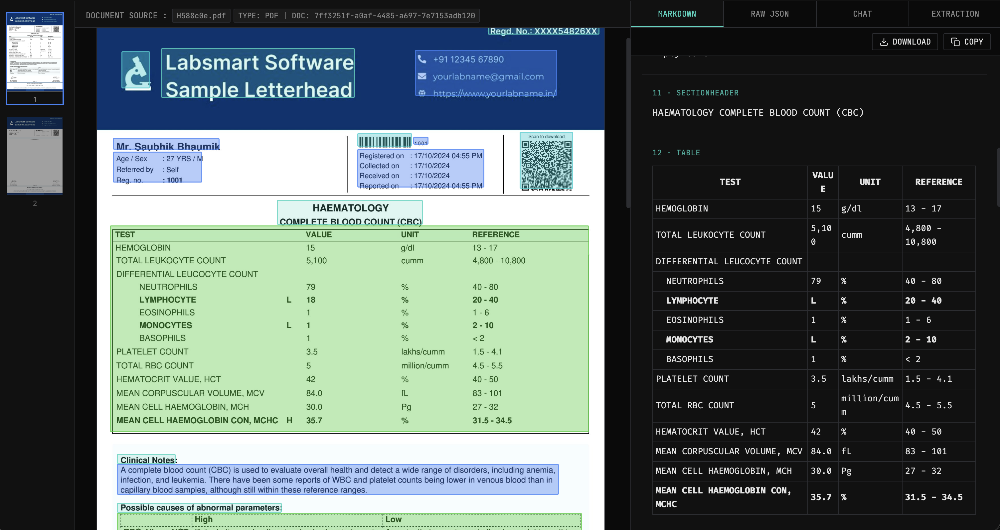
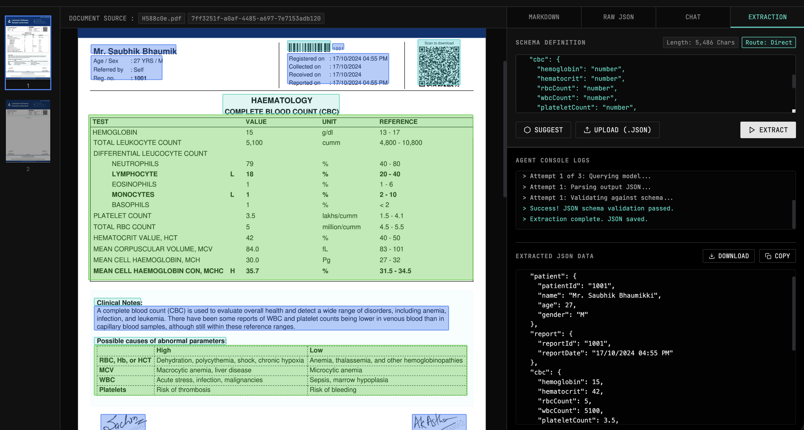

# Doco — Local Document Intelligence Platform

Doco is a privacy-first, fully local document intelligence platform inspired by LandingAI. It enables high-fidelity ingestion, structured data extraction, and semantic querying of PDFs and images—all without calling any external APIs. 

By combining layout-aware VLM OCR pipelines with self-correcting agentic JSON extraction and hybrid RAG, Doco runs entirely on local hardware, keeping sensitive documents 100% secure.

---

## Interface Preview

Here is the Doco workspace in action:





---

## Key Features

* **High-Fidelity Document Processing**: Ingests multi-page PDFs and images using **SuryaOCR** for layout analysis, bounding box coordinates, reading-order alignment, and high-accuracy text recognition.
* **Agentic JSON Extraction**:
  * **Interactive Schema Builder**: Manually edit, upload a custom `.json` schema, or query the local VLM to automatically **suggest a schema** based on the document's structure.
  * **Self-Correcting Critique Loop**: Validates LLM extractions against the target JSON schema using `jsonschema`. If validation fails, it feeds the exact parser errors back to the model for correction (up to 3 attempts).
  * **Threshold-Based Routing**: Automatically routes documents based on character count to optimize processing paths (Direct VLM Extraction vs Chunked fallbacks).
* **Local RAG Chat Interface**:
  * **Hybrid Search**: Leverages a combined vector search (**FAISS**) and keyword retrieval (**BM25**) ensemble retriever.
  * **Cross-Encoder Re-ranking**: Uses `ms-marco-MiniLM-L-6-v2` to re-rank chunks for high-relevance search context.
  * **SSE Streaming**: Answers user questions using Server-Sent Events (SSE) for real-time token-by-token streaming in the UI.
* **Dynamic Memory Optimization**: Automatically loads and unloads heavy Surya OCR models and Ollama services to prevent memory leaks and run efficiently on standard consumer hardware.

---

## Technology Stack

* **Backend**: Python 3.11+, FastAPI, LangChain, Pydantic, jsonschema, PyPDFium2, FAISS, rank-bm25, SentenceTransformers.
* **Local Models**: 
  * SuryaOCR (OCR, layout detection)
  * Ollama (`qwen2.5vl:7b`, `nomic-embed-text:v1.5`, `glm-ocr`)
* **Frontend**: Vanilla HTML5, CSS3 (OLED Dark/Palantir Dashboard design), JavaScript (SSE streaming, JSON validator, responsive panes).

---

## Getting Started

### 1. Prerequisites
Ensure you have **Ollama** installed on your system. Pull the required models:
```bash
ollama pull nomic-embed-text:v1.5
ollama pull qwen2.5vl:7b
```

### 2. Ingest dependencies
Clone the repository and set up a Python virtual environment:
```bash
# Set up virtual environment
python -m venv .venv
source .venv/bin/activate  # On Windows: .venv\Scripts\activate

# Install packages
pip install -r requirements.txt
```

### 3. Start the Platform
Run the FastAPI development server:
```bash
python main.py
```
Open your browser and navigate to `http://localhost:8000/`.

---

## Roadmap
* [ ] **Map-Reduce Chunked Extraction**: Fully implement map-reduce aggregation for extracting schemas from massive documents that exceed VLM context boundaries.
* [ ] **Multi-Document Indexes**: Run cross-document comparisons and search queries across the entire processed document library.
